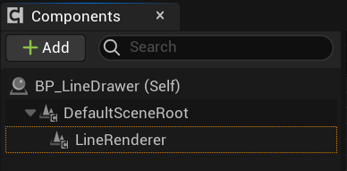
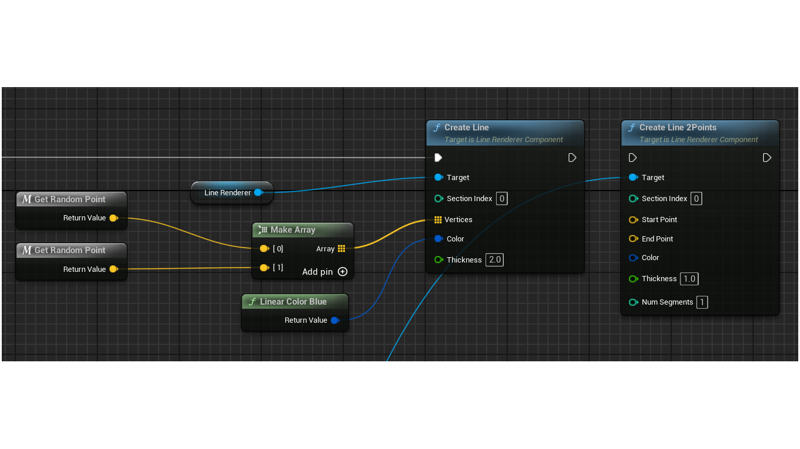
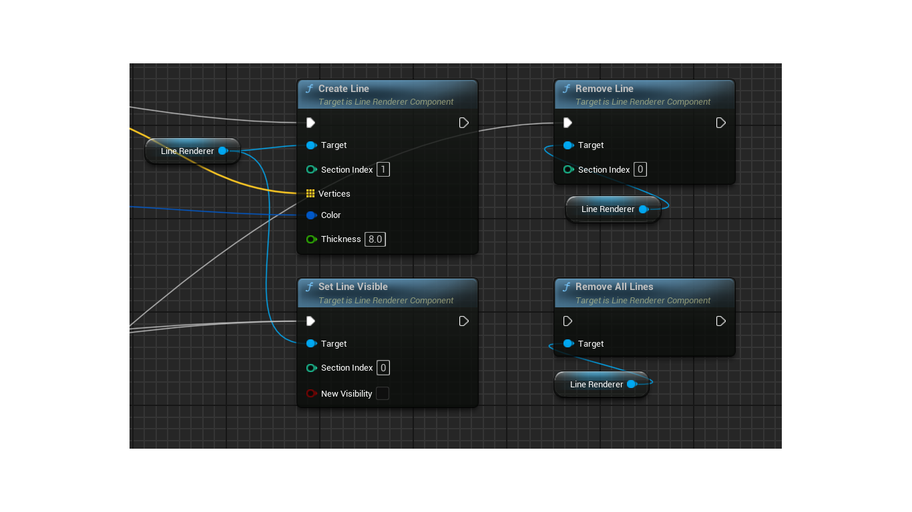
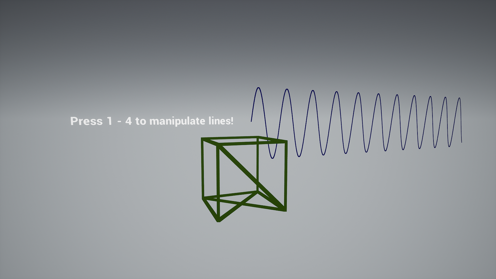

# Line Renderer Component

Line Renderer Component allows one to easily draw lines with thickness. Implementation is based on the engine BatchedLines with the modification to control how vertex buffers are filled with user data. This allows to have flexible system to control which lines should be shown, deleted and so on.

Features:
* Line drawing in Blueprints via simple interface (Actor Component)
* Each line has Unique ID (user has full control over it)
* Each line can have its own Thickness value as well as Color
* Line material customization (Lit, Unlit, Translucent, etc.)
* Per-line operators: hide/show, add/remove

## Customizations

Plugin provides two example Line materials (M_LineDrawer_Opaque_Unlit and M_LineDrawer_Opaque_Unlit) as well as the example level (can be found in Plugin's Content directory). Check Content/BP_LineDrawer for how to use API.

# How to use

Follow these steps:

1) Add Line Renderer Component to Actor/Blueprint:

3) Call Add Line Bluepint function, pass Section Index and Start and End vertices. Optionally, set Thickness and Line Color:

3) Line Manipulation:

Example result:

Platforms: Win64, Android, Linux, Mac

Engine versions: 5.1-5.3
